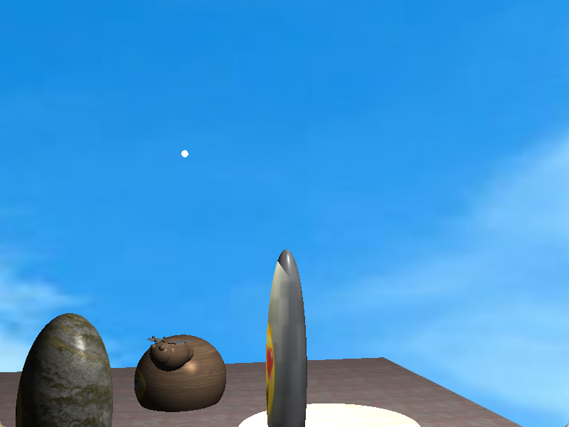

# 3D Computer Graphics · COM6503

Two complementary graphics projects: an interactive OpenGL scene with an animated bee and reactive statues, and a Blender-based study of how texture and shading choices affect statue-material realism. Together they explore hierarchical modelling, camera interaction, lighting and the visual differences between Phong-style and physically based materials.

中文概述：本仓库包含两次图形学作业：C++/OpenGL 蜜蜂场景，以及用 Blender 比较石、木、金属材质真实感的论文。两份正式提交均已保存，程序与论文的实现范围分开说明，原始文件保持不变。

## Project at a glance

| Field | Details |
| --- | --- |
| Course | COM6503 / COM3503 / COM4503, University of Sheffield |
| Project type | Individual interactive-graphics coursework and material-comparison report |
| Technology | C++17, OpenGL 3.3, GLSL, GLFW, GLM, GLAD, stb_image; Blender for Assignment 2 |
| Deliverables | Assignment 1 source/resources/ZIP; Assignment 2 original 19-page paper |
| Status | Both original submission attachments recovered; scene syntax checked; editable Blender working files absent |

## What it does

**Assignment 1 — The Buzzing Scene:** a bee assembled from transformed sphere meshes follows a five-waypoint patrol around three statues. The statues switch facial textures when the bee approaches. A textured ground, rotated cubemap skybox, camera controls and switchable light contributions form the scene.



*Screenshot from the original submission, not a new rendering run.*

**Assignment 2 — Statue-material realism:** the paper [How can computer graphics renderings of statues be made to look more realistic?](reports/assignment2/yongjiang_elp25aai_com6503.pdf) compares stone, weathered wood and metal using reference photographs, Phong-style renders and PBR renders. Both rendering variants were prepared in Blender. This study is related to the first assignment's lighting topic; the C++ scene itself has not been converted into a PBR renderer.

## Repository guide

| Location | Contents |
| --- | --- |
| [project/src/](project/src/) | Original interactive-scene code and generated GLAD loader |
| [project/shaders/](project/shaders/) | Object-lighting and cubemap shaders |
| [project/assets/](project/assets/) | Submitted textures and six skybox faces |
| [project/include/](project/include/) / [project/lib/](project/lib/) | Bundled headers and Windows GLFW libraries |
| [Assignment 2 paper](reports/assignment2/yongjiang_elp25aai_com6503.pdf) | Original Blender comparison, figures, bibliography and practical appendix |
| [archive/](archive/) | Original Assignment 1 ZIP and both submission records |
| [docs/](docs/README.md) | Build guide, source map, report guide, attribution and verification |

## Getting started

Assignment 1 targets **Windows x64 with MinGW, CMake, Ninja and an OpenGL 3.3-capable driver**. The included GLFW libraries are Windows artifacts. From a terminal configured for MinGW, at the repository root:

```bat
cmake -S project -B project/build-recovered -G Ninja -DCMAKE_C_COMPILER=gcc -DCMAKE_CXX_COMPILER=g++
cmake --build project/build-recovered
cd project\build-recovered
.\My3DGraphicsProject.exe
```

Run from a directory directly inside `project/`: the unchanged program uses paths such as `../assets/...` and `../shaders/...`. The [build guide](docs/BUILD.md) explains library compatibility and runtime paths. This is the original Windows setup, not a verified macOS/Linux port.

| Input | Action |
| --- | --- |
| W / A / S / D | Move the camera |
| Mouse / scroll | Look around / change field of view |
| F / G | Toggle spotlight / general light |
| M, then 1 / 2 / 3 | Enable position shortcuts and place the bee near a statue |
| Esc | Close the window |

For Assignment 2, start with the PDF and [report guide](docs/ASSIGNMENT2_REPORT.md). The paper contains the visual study, but no `.blend` project or exact render configuration was included in the recovered submission.

## Design and method

| Area | Approach |
| --- | --- |
| Bee hierarchy | Derive the head, eyes, antennae, tail and wing transforms from a common body matrix. |
| Animation | Move along fixed waypoints, face the travel direction, oscillate wings and add a visual hovering offset. |
| Statue reaction | Use the bee-to-statue distance to select normal or scared face textures. |
| Scene shading | Phong-style ambient/diffuse/specular terms, a positional general light and a fixed-origin spotlight with a rotating direction. |
| Environment | Repeat textures across a ground quad and rotate the cubemap view without translating the skybox. |
| Material study | Compare photo-textured Phong-style materials with multi-channel PBR node setups in Blender using three material cases. |

The paper's PBR study uses colour, roughness, metallic and normal inputs without displacement mapping. Its photographs and rendered triplets support a qualitative discussion; they are not a numerical rendering benchmark. See the [implementation map](docs/IMPLEMENTATION.md) and [report evidence guide](docs/ASSIGNMENT2_REPORT.md) for details.

## Results and verification

**Submitted evidence:** Assignment 1 includes a scene screenshot and an original README stating that it compiled on the original machine. Assignment 2 presents three node-graph screenshots and three photograph/Phong/PBR comparison triplets, concluding that material-dependent shading can improve the visual impression of realism.

**Recovery checks:** all nine C/C++ translation units passed syntax checks with Apple clang. All 21 packaged images, 19 literal resource paths and six cubemap faces were checked. The original ZIP, exposed project files and 19-page paper were verified byte for byte; the paper was read and visually reviewed.

No new Windows link, live shader compilation, interactive rendering or Blender experiment was performed during recovery or this documentation refresh. [Verification details](docs/verification.json) record that scope. Both observed original attachments are preserved; that does not recover working files absent from the submissions.

## Limitations

- Pose mode still calls the patrol update, so the position shortcuts do not permanently freeze the bee. The projection keeps the original 800/600 aspect ratio after a window resize.
- The CMake linkage and bundled GLFW binaries target Windows. Resource paths depend on the working directory.
- Assignment 2 lacks editable Blender scenes, standalone original photographs, exact material packages and render settings. The baseline and PBR variants use different texture sources, so the comparison does not isolate the effect of the shading model alone.
- No frame-rate study, objective image-quality metric or controlled user study is reported. Asset origins for the separate Assignment 1 textures are not documented.

## Attribution and provenance

Yongjiang Liu's original submissions are preserved with their declarations and acknowledgements. GLFW, GLM, GLAD, Khronos headers and stb_image retain their third-party identity and existing notices. The Assignment 2 paper names the author's photography and its FreePBR material references; those citations do not establish the origin of Assignment 1's different assets.

[Attribution](docs/ATTRIBUTION.md) explains the source and resource boundaries. The [Assignment 1 record](archive/assignment1/submission_record.json) and [Assignment 2 record](archive/assignment2/submission_record.json) preserve submission dates and checksums. The original reports and source remain unchanged in this repository.
